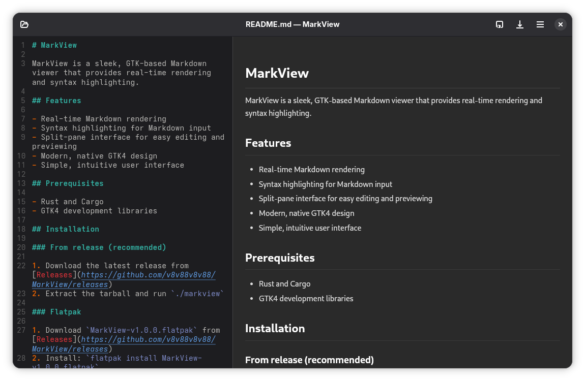

# MarkView

MarkView is a sleek, GTK-based Markdown viewer that provides real-time rendering and syntax highlighting.



## Features

- Real-time Markdown rendering
- Syntax highlighting for Markdown input
- Split-pane interface for easy editing and previewing
- Modern, native GTK4 design
- Simple, intuitive user interface

## Prerequisites

- Rust and Cargo
- GTK4 development libraries

## Installation

### From release (recommended)

1. Download the latest release from [Releases](https://github.com/v8v88v8v88/MarkView/releases)
2. Extract the tarball and run `./markview`

### Flatpak

1. Download `MarkView-v1.0.0.flatpak` from [Releases](https://github.com/v8v88v8v88/MarkView/releases)
2. Install: `flatpak install MarkView-v1.0.0.flatpak`
3. Run: `flatpak run io.github.v8v88v8v88.MarkView`

### From source

1. Clone the repository:
```bash
git clone https://github.com/v8v88v8v88/MarkView.git
cd MarkView
```

2. Build and run:
```bash
cargo run
```

### Build release binary locally

```bash
./scripts/build-release.sh
```

### Build Flatpak locally

```bash
flatpak install flathub org.gnome.Platform//46 org.gnome.Sdk//46 org.freedesktop.Sdk.Extension.rust-stable
flatpak-builder --force-clean build flatpak/io.github.v8v88v8v88.MarkView.yml
flatpak-builder --run build markview
```

### Create GitHub release

Push a version tag to trigger the release workflow (builds binary tarball + Flatpak bundle):

```bash
git tag v1.0.0
git push origin v1.0.0
```

## Dependencies

- gtk4 (0.9)
- gio (0.19)
- glib (0.19)
- sourceview5 (0.9)
- pulldown-cmark (0.10)

## Usage

1. Launch MarkView
2. Type Markdown in the left pane
3. View rendered output in real-time on the right pane
4. Use the hamburger menu for additional options

## Contributing

Contributions are welcome! Submit a Pull Request.

## License

GPL v2 License - see [LICENSE](LICENSE) file for details.

## Author

[v8v88v8v88](https://github.com/v8v88v8v88)
